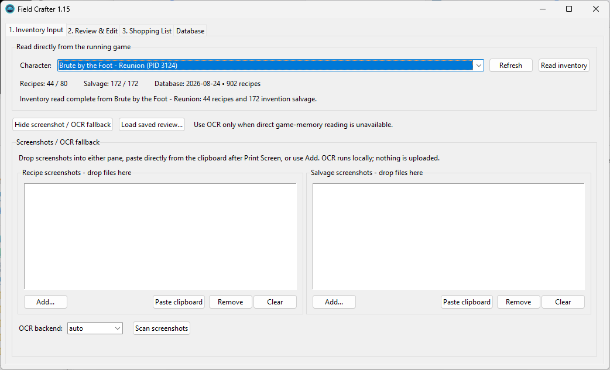
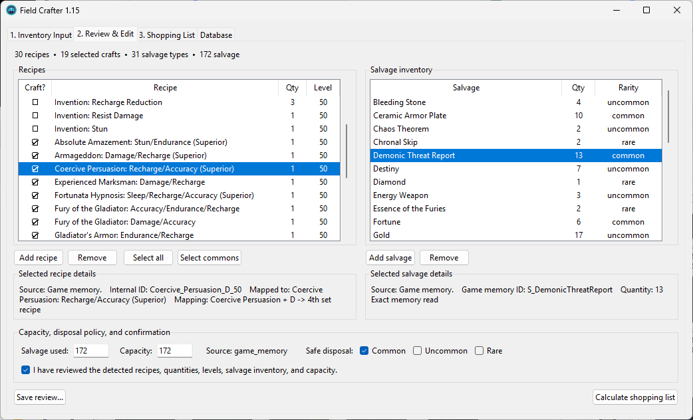
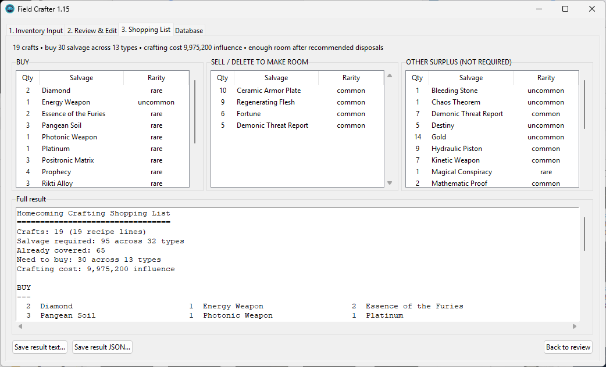

# Field Crafter

**Field Crafter** is a crafting inventory and shopping-list utility for **City of Heroes: Homecoming**.

It can read recipes and invention salvage directly from a running City of Heroes client on Windows, or use screenshots and local OCR as a fallback. After reviewing the detected inventory, Field Crafter calculates the salvage needed for your selected recipes, identifies surplus salvage, and helps determine whether enough inventory space is available before crafting.

## Download

### Windows EXE - Recommended

**[Download Field Crafter 1.16.1 for Windows](https://github.com/macskull/Field-Crafter/releases/download/v1.16.1/Field_Crafter_1.16.1.exe)**

Portable single-file Windows application. No Python installation is required.

### Python version

**[Download Field Crafter 1.16.1 Python](https://github.com/macskull/Field-Crafter/releases/download/v1.16.1/Field_Crafter_1.16.1_Python.zip)**

Requires 64-bit Python 3.13. The prepared Python package includes Field Crafter's validated crafting data and an offline dependency wheelhouse used to create its private Python environment.

### Release information

- **[View the full Field Crafter 1.16.1 release](https://github.com/macskull/Field-Crafter/releases/tag/v1.16.1)**
- **[Download SHA256SUMS.txt](https://github.com/macskull/Field-Crafter/releases/download/v1.16.1/SHA256SUMS.txt)**
- **[Download RELEASE_MANIFEST.json](https://github.com/macskull/Field-Crafter/releases/download/v1.16.1/RELEASE_MANIFEST.json)**

> The automatically generated **Source code (zip)** and **Source code (tar.gz)** files shown by GitHub are not the prepared Field Crafter Python distribution. Use `Field_Crafter_1.16.1_Python.zip` from the release assets instead.

## Features

- Read recipe and invention-salvage inventory directly from a running City of Heroes client.
- Select from multiple running City of Heroes characters.
- Screenshot and clipboard OCR fallback when memory reading is unavailable or undesired.
- Review and edit detected recipes and salvage before calculating.
- Highlight entries that require manual review.
- Select all recipes, common recipes, or individual recipes for crafting.
- Calculate:
  - Salvage that needs to be purchased.
  - Salvage that can be sold or deleted to make room.
  - Other surplus salvage.
  - Total crafting cost.
  - Whether sufficient inventory space is available.
- Local Homecoming recipe and salvage database.
- User-initiated crafting-database updates.
- Signed game-memory definition updates that can be checked separately from application releases.
- Signed full-application updates for the portable EXE and prepared Python distributions.
- Conservative session recovery for compatible game-memory layout changes.
- Offline-capable normal operation with bundled validated crafting and memory data.

## Screenshots

### Inventory Input

Read recipes and invention salvage directly from a running City of Heroes client, with screenshot/OCR input available as a fallback.



### Review & Edit

Review detected recipes and salvage, choose which recipes to craft, and inspect source or mapping details when needed.



### Shopping List

See the salvage to buy, recommended inventory disposals, surplus salvage, crafting cost, and full calculated result.



## Requirements

### EXE version

- Windows 10 or Windows 11.
- City of Heroes: Homecoming for direct game-memory inventory reading.

The portable EXE does not require a Python installation.

### Python version

- Windows 10 or Windows 11.
- 64-bit Python 3.13.

The prepared Python package includes the dependency wheels needed to create its private runtime environment, so first launch does not require a PyPI connection.

The crafting database and bundled game-memory definitions are also included with the release.

## Getting Started

### Portable EXE

Download:

`Field_Crafter_1.16.1.exe`

Place it anywhere you like and run it.

No installation is required.

Windows SmartScreen may warn about an unknown publisher because the application is not currently code-signed. You can verify the downloaded file against the published SHA-256 hashes as described below.

### Python version

Download and extract:

`Field_Crafter_1.16.1_Python.zip`

Keep the extracted folder together.

Launch Field Crafter by double-clicking:

`Field Crafter.pyw`

or by running:

```powershell
.\launch_gui.ps1
```

On first launch, the Python distribution creates a private Python environment from the dependency wheels included in the ZIP.

## Using Field Crafter

Field Crafter uses a three-step workflow.

### 1. Inventory Input

For direct game-memory reading:

1. Start City of Heroes and log into the character whose inventory you want to read.
2. Open Field Crafter.
3. Select the appropriate character and server.
4. Click **Read inventory**.

Field Crafter reads the character's recipe and invention-salvage inventory and sends the results to **Review & Edit**.

### 2. Review & Edit

Review the recipes and salvage detected by Field Crafter.

Recipes selected under **Craft?** are included in the shopping-list calculation.

Entries requiring manual review are highlighted in red. Selecting a recipe or salvage row displays additional details about how that item was detected.

When the inventory looks correct, confirm the review and continue to the shopping list.

### 3. Shopping List

Field Crafter calculates the selected crafting requirements and separates the results into:

- **BUY** - Salvage still required.
- **SELL / DELETE TO MAKE ROOM** - Surplus salvage that may be removed according to the selected disposal policy.
- **OTHER SURPLUS** - Additional salvage beyond the selected recipes' requirements.

The result also shows estimated crafting cost and whether enough inventory space is available.

## Screenshot / OCR Fallback

If direct game-memory reading is unavailable, recipe and salvage screenshots can be supplied using:

- File selection.
- Drag and drop.
- Clipboard paste.

OCR processing is performed locally on your computer. Screenshots are not uploaded by the OCR workflow.

Detected OCR confidence and related audit information are shown in the selected item's Details area when applicable.

Always review OCR-derived inventory before calculating a shopping list.

## Crafting Database Updates

Field Crafter ships with a validated Homecoming crafting database, so a database download is not required during normal first launch.

The **Database** tab provides user-initiated maintenance tools for:

- Checking Homecoming Wiki for crafting-data changes.
- Reviewing and accepting a validated candidate database.
- Refreshing game-memory recipe mappings when crafting data changes.

Crafting-database maintenance is separate from the signed memory-definition update system described below.

## Game-Memory Definition Updates

Field Crafter 1.16.1 adds a signed memory-definition update channel. This allows compatible memory-layout updates to be distributed independently of a full application reinstall.

Use **Check for memory updates** when you want Field Crafter to check the configured update channel.

Downloaded memory definitions are verified before they can become active. Verification includes the signed manifest, SHA-256 integrity checks, definition schema checks, version compatibility, and live validation against a running City of Heroes client.

Field Crafter also includes conservative session recovery for compatible memory-layout changes. Recovery evidence can be included in diagnostics when a memory read needs troubleshooting.
## Application Updates

Field Crafter 1.16.1 adds a separately signed full-application update channel for GitHub releases.

Use **Check for app updates** on the Database tab to check for a newer compatible release. Field Crafter verifies the signed update manifest and then checks the downloaded artifact's exact size and SHA-256 before staging any replacement. Portable EXE and prepared Python releases are both supported, with rollback handling if replacement fails.

Application updates are separate from crafting-database updates and game-memory definition updates.

## User Data

Field Crafter stores writable application data under:

```text
%LOCALAPPDATA%\FieldCrafter\
```

This may include:

- Active recipe database.
- Window settings.
- Database update cache and backups.
- User-level game-memory recipe mappings.
- Downloaded memory-definition updates under the `memory` folder.
- Memory-read diagnostics under the `diagnostics` folder.

Removing the application EXE or extracted Python folder does not automatically remove this user data.

## Privacy

Field Crafter is designed to perform normal inventory processing locally.

- Game-memory inventory reading occurs locally.
- Screenshot OCR occurs locally.
- Screenshots are not uploaded as part of the OCR workflow.
- Internet access is used when you explicitly check for Homecoming crafting-data updates, signed memory-definition updates, or signed application updates.

## Verify Your Download

Each public release includes SHA-256 hashes in:

**[SHA256SUMS.txt](https://github.com/macskull/Field-Crafter/releases/download/v1.16.1/SHA256SUMS.txt)**

To verify the portable EXE in PowerShell:

```powershell
Get-FileHash ".\Field_Crafter_1.16.1.exe" -Algorithm SHA256
```

To verify the Python ZIP:

```powershell
Get-FileHash ".\Field_Crafter_1.16.1_Python.zip" -Algorithm SHA256
```

Compare the returned hash with the corresponding value in `SHA256SUMS.txt`.

The values must match exactly. Letter case does not matter.

A matching hash confirms that your downloaded file is byte-for-byte identical to the published release artifact.

## Reporting Problems

Field Crafter 1.16.1 is being made available as a public test release.

If you encounter a problem, please **[open an Issue](https://github.com/macskull/Field-Crafter/issues)** and include as much relevant information as possible, such as:

- Field Crafter version.
- EXE or Python version.
- Whether the inventory came from game memory or OCR.
- What you expected to happen.
- What actually happened.
- Any displayed error message.
- A screenshot when useful.

For recipe-mapping problems, the information displayed in the selected recipe's Details section can be especially helpful.

For game-memory problems, include the relevant diagnostic JSON from:

```text
%LOCALAPPDATA%\FieldCrafter\diagnostics\
```

when one is available.

## Version

**Field Crafter 1.16.1 - Public Test Hotfix**
